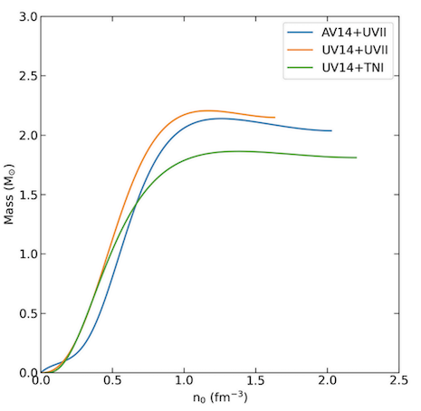

# PHYS 4347 Computational Project

**Author:** Riley Smith, GTiD: 904084131  
**Date:** April 2025

---

## Introduction and Background

Neutron stars (NS) are formed from the collapsed cores of massive stars that have exploded as supernovas. NS are incredibly dense objects, of the order of \(10^{17}\) kg/m\(^3\). Due to the density of NS, their internal structure and nature cannot be described accurately through the use of Newtonian physics. Instead, equations of state that describe the relationship between pressure and density are used.

These equations are developed through the use of theoretical modelling, astrophysical observations, and the consideration of other physics theories, such as quantum chromodynamics, and general relativity. 

The purpose of this project is to numerically model different equations of state that describe the mass and radius of NS over a range of central densities. This is done through the integration of Tolman-Oppenheimer-Volkoff equations using a fourth-order Runge-Kutta method.

Three equations of state were modelled, originally developed by Wiringa et al. (1988), then parameterised for ease of integration by Kutschera & Kotlorz (1993). The equations of state are as follows:  
$$
\textbf{AV14+UVII: } E(n) =2.6511+76.744n-183.611n^2+459.906n^3-122.832n^4
$$  
$$
\textbf{UV14+UVII: } E(n) =7.57891 - 1.23275n+227.384n^2-146.596n^3+324.823n^4-120.355n^5
$$  
$$
\textbf{UV14+TN1: } E(n) =6.33041-28.1793n+288.397n^2-65.2281n^3
$$

The results are shown in three plots: Mass v Density, Radius v Density, and Mass v Radius. These are compared to expected values from previous modelling of these equations of state. Figure **MassRadius** also includes empirical data from PSR J0030+0451 and PSR J0740+6620, this is in order to understand the validity of the equations of state. Figure **MassRadius** is also compared to Figure **Fig2Compare** from the paper by Lattimer & Prakash (2001). 

---

## Theoretical Framework

The equations that are used to solve the equations of state are as follows:  
Structure equations:  
$$
\frac{du}{dR} = 4\pi \epsilon R^2
$$  
$$
\frac{dt}{dR} = -4\pi R \left(P + \frac{u}{4\pi R^3}\right) \cdot \frac{P + \epsilon}{1 - \frac{2u}{R}}
$$

Energy density and pressure from the equations of state:  
$$
\epsilon(n) = n \left[ E(n) + m_n c^2 \right]
$$  
$$
P(n) = n^2 \frac{dE}{dn}
$$  
$$
u = \frac{M_r}{\tilde{M}}, \quad R = \frac{r}{\tilde{r}}
$$

The initial conditions for the integration are as follows:  
$$
R = 0, \quad u = 0, \quad t = t_0
$$

---

## Results

### Mass vs Density

  

    
    
Mass vs Density relationship generated from written code

  

  

    
    
Expected Plot of Mass vs Density

  

---

### Radius vs Density

  

    
    
Radius vs Density relationship generated from written code

  

  

    
    
Expected Plot of Radius vs Density

  

---

### Mass vs Radius

  

    
    
Mass vs Radius relationship generated from written code

  

  

    
    
Expected Plot of Mass vs Radius

  

---

## Discussion

The three equations of state that were plotted showed values with a \(\sim25\%\) inflation compared to that of the previously modelled equations of state, such as Figures **MassDensityExpected**, **RadiusDensityExpected**, and **MassRadiusExpected**. The issue that caused this was not found and thus should be investigated further in order to generate more accurate plots.

### NS Mass v Density

As shown in Figure **MassDensity**, each equation of state follows the expected trend where mass increases with central density up to a maximum before sharply dropping off. The maximum mass is highest for the UV14+UVII model, indicating a stiffer equation of state that can support more mass against gravitational collapse. In contrast, the UV14+TNI model reaches its peak mass at a lower central density.

The UV14+UVII equation of state ends at the lowest central density, indicating that the NS becomes unstable first compared to other equations of state.

### NS Radius v Density

In Figure **RadiusDensity**, all three models show that radius generally decreases with increasing central density. This is consistent with more compact, denser stars forming as pressure rises. The rate at which the radius decreases and the absolute values predicted differ between models. The UV14+TNI model predicts the smallest radii across most of the density range.

The UV14+TNI equation of state ends at the lowest central density, indicating that the NS becomes unstable first compared to other equations of state.

### NS Mass v Radius

Figure **MassRadius** combines the trends of the other two plots and shows a clear peak in mass at a specific radius for each equation of state. Beyond this point, the mass drops off rapidly, where the star begins to be unstable. Observational data from PSR J0030+0451 and PSR J0740+6620 are also shown on the plot. These data points both UV14+UVII and UV14+TNI are most consistent with measured values, while neither passes through the recorded pulsar data, it could be reasoned that it is within an acceptable margin of error.

### Comparison to Literature

Figure **Fig2Compare** from Lattimer & Prakash (2001) shows similar mass-radius trends. The shapes of our curves agree with theirs over the stable region. However, the models begin to diverge at high central densities.

---

## Conclusion

This project explored the dependence of neutron star mass and radius on the equation of state used to describe dense nuclear matter. By numerically integrating the relativistic structure equations for a range of central densities, mass-radius relationships were generated for three parameterised equations of state: AV14+UVII, UV14+UVII, and UV14+TNI.

---

### Lattimer & Prakash (2001) Figure 2

